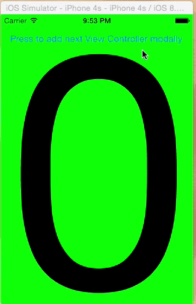
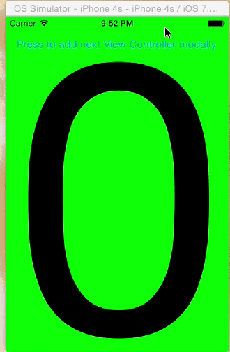

# Objective
Purpose of this repo is to collect demo apps for iOS bugs that I've been able to find so far.
Sample apps are used for filing Apple Radar tickets.

#iOS8 modal dismiss bug. 

Apple radar 20167513.

Duped open radars:
http://openradar.appspot.com/18421969, 
http://openradar.appspot.com/18834972

DismissiOS8Bug sample app demonstrates iOS8 modal dismissal regression in
- (void)dismissViewControllerAnimated:(BOOL)flag
                           completion:(void (^)(void))completion

According to Apple documentation:
If you present several view controllers in succession,
thus building a stack of presented view controllers,
calling this method on a view controller lower in the stack
dismisses its immediate child view controller and
all view controllers above that child on the stack.
When this happens, only the top-most view is dismissed in an animated fashion;
any intermediate view controllers are simply removed from the stack.

However, top most view dismission is broken on iOS8.
                           
See how iOS7 animates out screen with "2", while iOS8 animates out screen with "1". 
iOS8 has a regression in dismissViewControllerAnimated:completion:

Compare iOS8 behavior (left) to iOS7(right). Note that correct behavior is to animate out red screen (number 2), because it is the top most view. iOS8 however dismisses top most view without animation and animates out yellow screen (number 1)

*****************Wrong behavior iOS8**********************************Correct behavior iOS7*******************
 

#iOS navigation bar height rotation bug. 
Apple radar 20167526.

OpenRadar http://openradar.appspot.com/radar?id=6067412050903040

Apple HID states: "iOS automatically makes various layout changes when the size classes of a display environment change. For example, when the vertical size class changes from compact to regular, navigation bars and toolbars automatically become taller."

It is true that navigation bars and toolbars do change height. they become taller in regular vertical size and shorter in compact size.
However, once you add a second window with UINavigationViewController in there this rule breaks for navigation bar as seen in this demo.
Note that one navigation bar does change its height, while another one stays as is.
Toolbar height change works correctly, that's why it is missing from the demo.

#iPad vs iPhone UIBarButtonItem view changes on rotation
It is possible to find out view of UIBarButtonItem by doing following hack 

UIView *view = [tabBarItem valueForKey:@"view"]

Sometimes you need this to obtain location of the UIBarButtonItem to present something from it.

However, iPhone and iPad behave differently. iPhone sometimes creates new view for UIBarButtonItem in the UIToolbar which can breakiyour code if you save pointer to view of UIBarButtonItem.

See for yourself.

iPhone changes UIView address in the end on third rotation.

iPad sticks to existing UIView address despite all the rotations.

